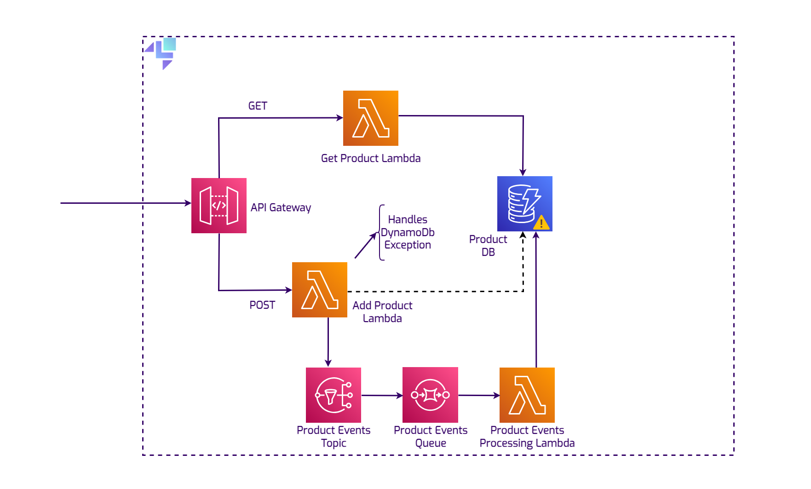

# Chaos Plugin

| Environment      |  |
|------------------|-----------------------------------------|
| __Services__     | API Gateway, Lambda, DynamoDB, SNS, SQS |
| __Categories__   | LocalStack Pro, Init Hooks, Java SDK    |


## Description

In this sample, we use LocalStack Chaos Plugin to cause controlled outages in the DynamoDB service to study the resiliency of the architecture and improve fault tolerance.
This kind of test helps to ensure that the software can handle database downtime gracefully by implementing strategies such as queuing requests to prevent data loss.
This proactive error handling ensures that the system can maintain its operations despite partial failures.


## Prerequisites

- [Maven 3.8.5](https://maven.apache.org/install.html) & [Java 17](https://www.java.com/en/download/help/download_options.html)
- [LocalStack](https://localstack.cloud/)
- [Docker](https://docs.docker.com/get-docker/) - for running LocalStack


## Before starting

Make sure to build the Lambda function by running the following command in the root folder

```
cd lambda-functions && mvn clean package shade:shade
```


### Starting LocalStack

```bash
export LOCALSTACK_AUTH_TOKEN = <your_localstack_auth_token>
docker compose up
```

### Creating the resources

The resources are created via `init hooks` at startup, using the `init-resources.sh` file.

### Creating a Product

Using cURL we can create a Product entity:

```text
$ curl --location 'http://12345.execute-api.localhost.localstack.cloud:4566/dev/productApi' \
--header 'Content-Type: application/json' \
--data '{
  "id": "prod-2004",
  "name": "Ultimate Gadget",
  "price": "49.99",
  "description": "The Ultimate Gadget is the perfect tool for tech enthusiasts looking for the next level in gadgetry. Compact, powerful, and loaded with features."
}'
⏎
Product added/updated successfully.
```

### Creating an experiment

The shell script [outage-dynamodb-start.sh](./outage-dynamodb-start.sh) configures the Chaos API to cause faults within DynamoDB.
The configuration targets all operations in the DynamoDB service.
If required, you may filter specific operations such as `PutItem` or `GetItem`, but in this case we just want to cut off the database service completely.
This configuration will result in a 100% failure rate for all API calls to DynamoDB, each accompanied by an HTTP 500 status code with a `DatacentreNotFound` error.

When the script is run, the database becomes inaccessible not only for external clients but also for all services within LocalStack.
This means that service integrations can no longer retrieve or create new products.
API Gateway will return an Internal Server Error.
This is obviously problematic, but luckily, this potential issue has been caught early enough in the development phase, that the engineer can include proper error handling and a mechanism
that prevents data loss in case of an outage of the database.



At this point, we can try to make the architecture more resilient to such failures.
The solution includes an SNS topic, an SQS queue and a Lambda function that will pick up the queued element and retry the `PutItem` on the database.
In case DynamoDB is still unavailable, the item will be re-queued.

```text
$ curl --location 'http://12345.execute-api.localhost.localstack.cloud:4566/dev/productApi' \
    --header 'Content-Type: application/json' \
    --data '{
        "id": "prod-1003",
        "name": "Super Widget",
        "price": "29.99",
        "description": "A versatile widget that can be used for a variety of purposes. Durable, reliable, and affordable."
    }'
⏎
A DynamoDB error occurred. Message sent to queue.
```

Now this element sits in the queue, until the outage is over and the database is accessible again. 

The outage can be ended by running the shell script [outage-dynamodb-end.sh](./outage-dynamodb-end.sh).
Now, the Product element that initially has not reached the database, should reach its destination.
This can be verified by scanning the database:

```text
$ awslocal dynamodb scan --table-name Products
⏎
{
    "Items": [
        {
            "name": {
                "S": "Super Widget"
            },
            "description": {
                "S": "A versatile widget that can be used for a variety of purposes. Durable, reliable, and affordable."
            },
            "id": {
                "S": "prod-1003"
            },
            "price": {
                "N": "29.99"
            }
        },
        {
            "name": {
                "S": "Ultimate Gadget"
            },
            "description": {
                "S": "The Ultimate Gadget is the perfect tool for tech enthusiasts looking for the next level in gadgetry. Compact, powerful, and loaded with features."
            },
            "id": {
                "S": "prod-2004"
            },
            "price": {
                "N": "49.99"
            }
        }
    ],
    "Count": 2,
    "ScannedCount": 2,
    "ConsumedCapacity": null
}
```
